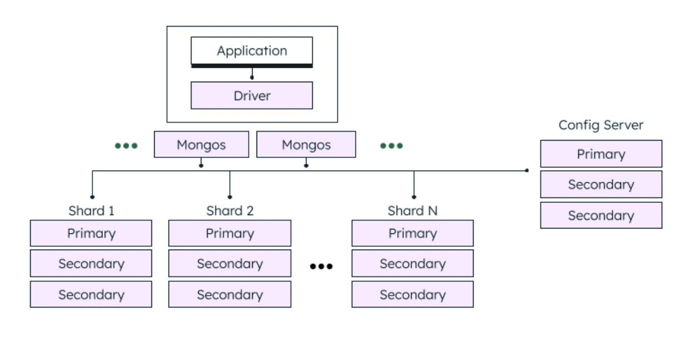

## 몽고DB 소개
해당 챕터는 몽고DB 를 만든 주요 디자인 결정이 무엇인지 정리한다.

### 1.1 손쉬운 사용 
몽고DB 는 document-oriented database 이다. relational model을 사용하지 않은 이유는 다음과 같이 정리해볼 수 있다.
* 분산 확장(scale-out)을 쉽게 하기에 용이하다. (특히 Horizontal Scaling에 용이하다)
* 내장형 Document 를 통해 OOP 프로그래밍을 쉽게 할 수 있다.
  * 확실히 Relational Database 의 디자인은 OOP 디자인과 상이하다. RDB 에서는 이 두 디자인의 간극을 ORM 레이어가 이어주고 있는데, document-oriented database 에서는 저장되는 데이터 자체가 복잡한 계층 구조를 표현하는 데에 용이하므로, 손쉽게 OOP 프로그래밍을 할 수 있다.
* Schemaless Design 
  * Document Database 에서는 기본적으로 고정된 스키마가 없으므로, 유연한 프로그래밍이 가능하다.

<hr />

### 1.2 확장 가능한 설계
몽고DB 는 분산 확장을 염두에 두고 설계되었다. MongoDB 는 Config Server 와 Shard 들로 구성하여 Horizontal 확장을 손쉽게 할 수 있다고 한다. mongos 라우터는 각각의 샤드에 도큐먼트를 재분배하고, 사용자 요청을 올바른 장비에 라우팅한다.


> https://www.mongodb.com/docs/v6.0/core/sharded-cluster-components/


### 1.3 다양한 기능
몽고DB 는 DBMS 의 대부분의 기능과 더불어 다음과 같은 기능을 제공한다

* 인덱싱
  * 보조 인덱스, unique, compound, full-text 인덱싱 기능도 제공한다. nested document 와 배열과 같은 계층 구조에서도 인덱스를 지원한다.
  <br />
  > Secondary Index는 Primary Index와 달리 document의 특정 field value에 대한 indexing을 지원하는 인덱스입니다. Secondary Index는 일반적으로 조회(Read) 성능을 높이는데 사용되며, disk space overhead를 추가적으로 발생시킬 수 있습니다. 
* 집계
  * 몽고DB 는 집계 프레임워크를 제공한다. 
* 특수한 컬렉션 유형 
  * 특정 시간에 만료해야 하는 데이터에 대해 TTL 옵션을 제공한다.
  * 기준 필터와 일치하는 도큐먼트에 PARTIAL INDEX 를 제공한다.
    ```javascript
    // Partial Index
    // 위 코드에서 score 필드값이 45보다 큰 문서의 field 필드만 인덱싱합니다.
    db.collection.createIndex( { field: 1 }, { partialFilterExpression: { score: { $gt: 45 } } } )
    ```
* 파일 스토리지
  * 몽고DB 는 큰 파일과 파일 메타데이터를 편리하게 저장하는 프로토콜을 지원한다.
* JOIN
  * 몽고 DB 에서는 복잡한 JOIN 은 존재하지 않는다. `$lookup` 집계 연산자를 사용함으로써 매우 제한된 방식으로 조인을 지원한다.

### 1.4 고성능
몽고DB의 주요 목표인 성능은 몽고DB 설계에 많은 영향을 미쳤다. 몽고DB 는 관계형 DB 의 많은 기능을 포함하지만, 관계형 DB 의 모든 작업을 전부 대체하지는 않는다. 이러한 간소한 설계 덕분에 몽고DB 는 뛰어난 성능을 발휘한다.

### 몽고DB 의 철학
몽고DB 프로젝트의 주 관심사는 확장성이 높으며 유연하고 빠른, 즉 완전한 기능을 갖춘 데이터 스토리지를 만드는 일이다.